name: inverse
layout: true
class: center, middle, inverse, animated, jackInTheBox

---
layout: false

class: center, middle
title: Support Vector Machines
subtitle: Subtitle
author: Darlan Cavalcante Moreira
date: 2018-09-24

.title[
{{title}}]

<!-- .subtitle[{{subtitle}}] -->

&nbsp;
&nbsp;
&nbsp;
&nbsp;
&nbsp;

.titlepagebody[
.author[{{author}}]

.institution[GTEL]

.date[{{date}}]
]

.footnote[Created with [{Remark.js}](http://remarkjs.com/) using [{Markdown}](https://daringfireball.net/projects/markdown/) +  [{MathJax}](https://www.mathjax.org/)]

---
layout: true

.frametitle[
# Intuition
]

- Suppose we have a population of 50%-50% males and females
- We want to identify whether an individual is a Male or a Female
- **Features**: Individual height and individual and Hair Length

---

.center[<svg id="intuition_plot", height="430px"></svg>]

---

.center[<svg id="intuition_plot2", height="430px"></svg>]

---

.center[<svg id="intuition_plot3", height="430px"></svg>]

---

.center[<svg id="intuition_plot4", height="430px"></svg>]

---
layout: false

.frametitle[
# Intuition
]

- We call the samples closest to the frontier the "support vectors"

--

## Questions

--

- How can we find the support vectors?
--

- What is the best frontier?
--

- **Natural approach**: put the frontier as far away as possible from any support vector
--

Note:

This is the <strong>Maximal Margin Classifier</strong>

---

.frametitle[
# Maximal Margin Classifier
]

- Elegant and simple
--

- But cannot be applied to most datasets
  - Requires the classes to be separatable by a linear boundary
--

- The linear boundary is called an **hyperplane**

--

Note:

In a p-dimensional space, a hyperplane is a flat affine subspace of dimension p − 1

---
layout: true

.frametitle[
# What is an Hyperplane
]

---

- Examples of Hyperplanes:
  - In two dimensions it is a flat one-dimensional subspace ➡ a line
$$\beta_0 + \beta_1 X_1 + \beta_2 X_2 = 0$$
--

  - In three dimensions it is a flat two-dimensional subspace ➡ a plane
--

  - In $p$ dimensions it is a flat $p-1$-dimensional subapce
$$\beta_0 + \beta_1 X_1 + \beta_2 X_2 + \ldots + \beta_p X_p = 0 \tag{1}$$
--

Note:

If $X = (X_1, X_2, \ldots, X_p)^T$ and $(1)$ holds, then $X$ is a point on the hyperplane

---

- The hyperplane as dividing p-dimensional space into two halves
--

- We can easily determine on which side of the hyperplane a point lies by
  calculating the sign of the left hand side of $(1)$

.center[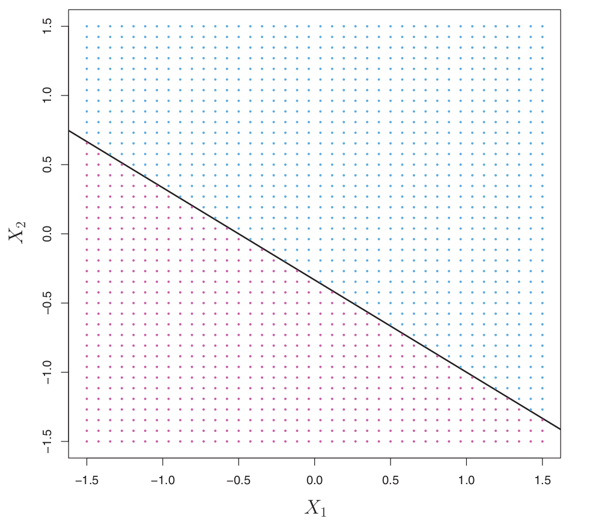 Hyperplane for $1+2X_1+3X_2=0$]

--
Region where $1+2X_1+3X_2 > 0$
Region where $1+2X_1+3X_2 < 0$

---
layout: true

.frametitle[
# Classification
## Using a Separating Hyperplane
]

---

- Suppose that we have a $n \times p$ data matrix $\mtX$ that consists of $n$
training observations in $p$-dimensional space

  <math>$$\vtX_1 = \begin{bmatrix} x_{11} \\ \vdots \\ x_{1p}\end{bmatrix}, \ldots,\vtX_n=\begin{bmatrix}x_{n1}\\ \vdots \\ x_{np}\end{bmatrix}$$</math>

  and that these observations fall into two classes

- Suppose that it is possible to construct a hyperplane that separates the
training observations **perfectly** according to their class labels

???
- It is not always possible find a separating hyperplane that perfect separate
  the classes

---

### Examples of three separating hyperplanes

.footnote[We can label the observations as $y_i = 1$ and $y_i=-1$ for the blue and purple classes, respectively]

<!-- .center[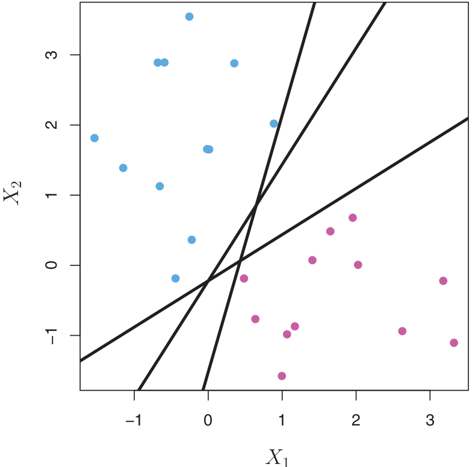] -->

<!-- 
A classifier based on a separating hyperplane leads to a linear decision boundary
 -->

.center[
.captionbox[

.caption[A classifier based on a separating hyperplane leads to a linear decision boundary]
]]

<!-- --- -->

<!-- - A separating hyperplane has the property that -->

<!--   $$\beta\_0 + \beta\_1 x\_{i1} + \beta\_2 x\_{i2}+\ldots+\beta\_p x\_{ip} > 0 \qquad\qquad\text{if } y = 1$$ -->
<!--   and -->
<!--   $$\beta\_0 + \beta\_1 x\_{i1} + \beta\_2 x\_{i2}+\ldots+\beta\_p x\_{ip} < 0 \qquad\qquad\text{if } y = -1$$ -->
<!-- -- -->

<!-- - We can rewrite this property as -->

<!--   $$y\_i(\beta\_0 + \beta\_1 x\_{i1} + \beta\_2 x\_{i2}+\ldots+\beta\_p x\_{ip}) > 0$$ -->

<!--   for all $i=1,\ldots,n$ -->

---

- We classify a test observation $x^*$ based on the sign of

  <math>$$f(x^*) = \beta_0 + \beta_1 x^*_{1} + \beta_2 x^*_{2}+\ldots+\beta_p x^*_{p}$$</math>
--

- If $f(x^*)$ is positive we assign the test observation to class $1$ and if it is negative we assign it to class $-1$
--

- We can also use the magnitude of $f(x^\*)$
  - If it is far from zero then $x^\*$ lies far from the hyperplane
  - We can be confident the class assignment of $x^\*$

---
layout: false

.frametitle[
# The Maximal Margin Classifier
]

- A natural choice for a hyperplane is the **maximal margin hyperplane**
  - The hyperplane that is farthest from the training observations
--

- We can compute the (perpendicular) distance from each training observation to
  a given separating hyperplane
--

- The smallest such distance is the minimal distance from the observations to
  the hyperplane
  - This distance it known as the **margin**
--

Note:

The maximal margin hyperplane is the separating hyperplane for which the margin is largest

--

- If we classify based on which side of the maximal margin hyperplane an
  observation lies, we get **Maximal Magin Classifier**

---
template: inverse

# Our Hope

A classifier with a large margin on the training data will also have a large margin on test data and hence it will classify the test observation correctly

---
layout: true
.frametitle[
# The Maximal Margin Classifier
]

- In the figure we see that the trainning observations are equidistant from the
  maximal margin hyperplane and lie along the dashed line

---

<!-- .center[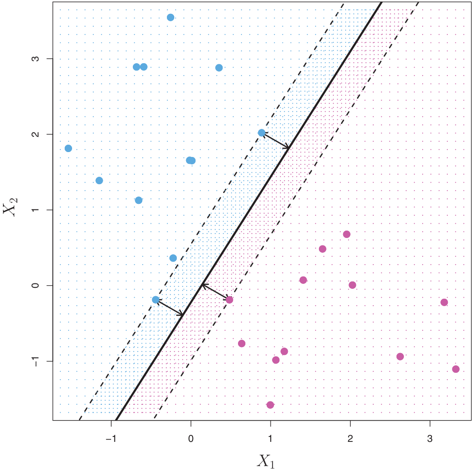] -->

<!-- 
These three observations are known as the "support vectors"
 -->

.center[.captionbox[

]]

---
count: false

.center[.captionbox[

.caption[.animated.fadeInRight[
These three observations are known as the "support vectors"]]
]]

???

- Notice the width of the margin
- The maximal margin hyperplane **only depend on the support vector**
- A movement to any of the other observations would not affect the separating
  hyperplane, provided that the observation’s movement does not cause it to
  cross the boundary set by the margin

---
layout: false
.frametitle[
# The Maximal Margin Classifier
## Construction
]

$$\begin{align}
& \underset{\beta\_0, \beta\_1, \ldots, \beta\_p, M}{\text{maximize}} & & M \tag{2a} \\\\
& \text{subject to} & & \sum\_{j=1}^p\beta\_j^2=1 \tag{2b}\\\\
& & & y\_i(\beta\_0 + \beta\_1 x\_{i1} + \beta\_2 x\_{i2} + \ldots + \beta\_p x\_{ip}) \geq M \tag{2c}
\end{align}$$
--

- $\text{(2c)}$ guarantees that each observation will be on the correct side of
the hyperplane, **provided that M is positive**
--

- $\text{(2b)}$ is not really a constraint on the hyperplane, but it adds meaning to $\text{(2c)}$
--

- The perpendicular distance from the $i$th observation to the hyperplane is given by

<math>$$y_i(\beta_0 + \beta_1 x_{i1} + \beta_2 x_{i2} + \ldots + \beta_p x_{ip})$$</math>

???

- Briefly, the maximal margin hyperplane is the solution to the optimization problem

---

.frametitle[
# The Non-separable Case
]

- In many cases a separating hyperplane does not exist

<!-- 
We cannot *exactly* separate the two classes
 -->
<!-- .center[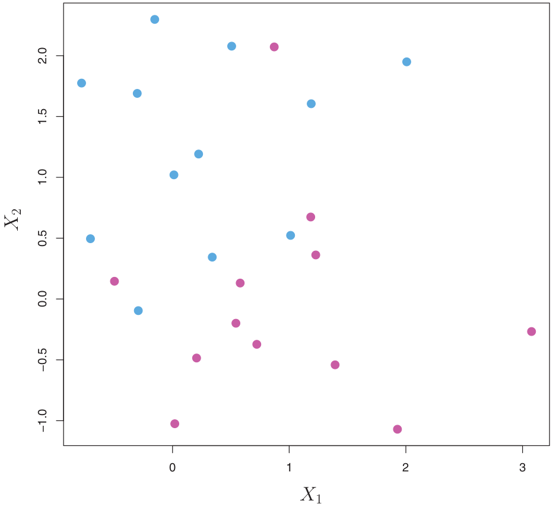] -->

.center[
.captionbox[

.caption[We cannot *exactly* separate the two classes]
]]

???

- The maximum margin classifier is a very natural way to perform classification, **if a separating hyperplane exists**
- If an hyperplane does not exist then the optimization problem has no solution

--

- The previous optimization problem has no solution!

---
template: inverse

# Desire

Generalize the maximal margin classifier to the non-separable case ➡ Find a hyperplane that *almost* separates the classes

---
layout: true

.frametitle[
# Support Vector Classifier
## Motivation
]

---

- A classifier based on a separating hyperplane will necessarily perfectly
  classify all of the training observations
--

- In order to generalize the maximal margin classifier to the non-separable case
  we can use a so-called *soft margin*
--

  - We address this new classifier as "Support Vector Classifier"
--

- Even if a separating hyperplane does exists, there are cases where a
  classifier based on *hard margin* might not be desirable
--

  - A *hard margin* is too sensible to individual observations ➡ it may overfit the data
--

- By using a soft-margin we get:
 - Greater robustness to individual observations, and
 -  Better classification of most of the training observations.
---

- This hyperplane looks reasonable

<!-- .center[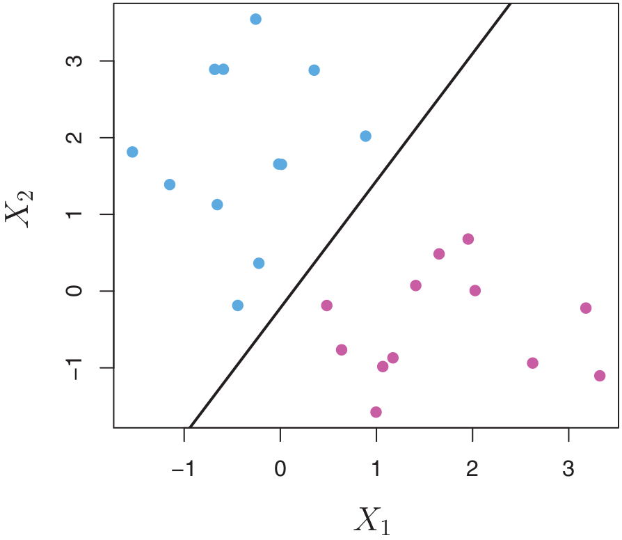] -->

<!-- But what happens if we add a new training observation? -->

.center[
.captionbox[

.caption[But what happens if we add a new training observation?]
]]

---
layout: true
.frametitle[
# Support Vector Classifier
## Motivation
]

- 🤔, It does not look that nice anymore ➡ the margin is very thin

---

<!-- .center[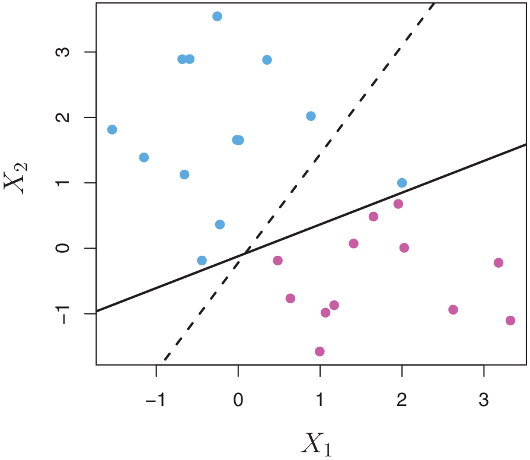] -->

.center[
.captionbox[

]]

---

count: false

.center[
.captionbox[

.caption[.animated.fadeInRight[
Look how far a single new observation changed the hyperplane]]
]]

???

- The addition of a single observation leads to a **dramatic change** in the
maximal margin hyperplane.
- The resulting maximal margin hyperplane is not satisfactory: **for one thing,
it has only a tiny margin**
- This is problematic because as discussed previously, the distance of an
observation from the hyperplane can be seen as a measure of our confidence that
the obser- vation was correctly classified.

---
template: inverse

# Insight

It is worthwhile to misclassify a few training observations in
order to do a better job in classifying the remaining observations

---
layout: false
.frametitle[
# Support Vector Classifier
## Overview
]

- The support vector classifier allow some observations to be on the incorrect
  side of the margin
--

  - or even on the incorrect side of the hyperplane
--

- Observations on the wrong side of the hyperplane correspond to training
  observations that are misclassified by the classifier
--

Note:

When there is no separating hyperplane, such a situation is inevitable

---

layout: true
.frametitle[
# Support Vector Classifier
## Example
]

---

- A support vector classifier was fit to a small data set

.center[
.captionbox[
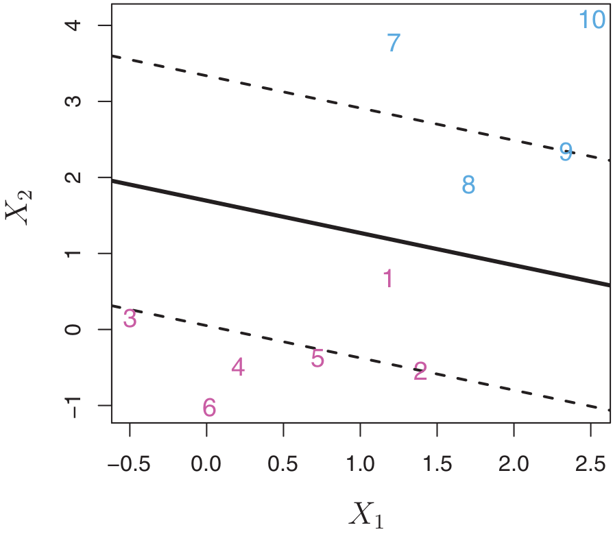
]]

---
count: false

- A support vector classifier was fit to a small data set

.center[
.captionbox[

.caption[.animated.fadeInRight[
We have points on the wrong side of the margin]]
]]

<!-- 
<!-- width:13em">We have points on the wrong side of the margin -->

???

- No observations are on the wrong side of the hyperplane.
- We could have found an hyperplane and a margin size where all points would be
  on the right side of the margin

---

- Add two additional points, $11$ and $12$

<!-- .center[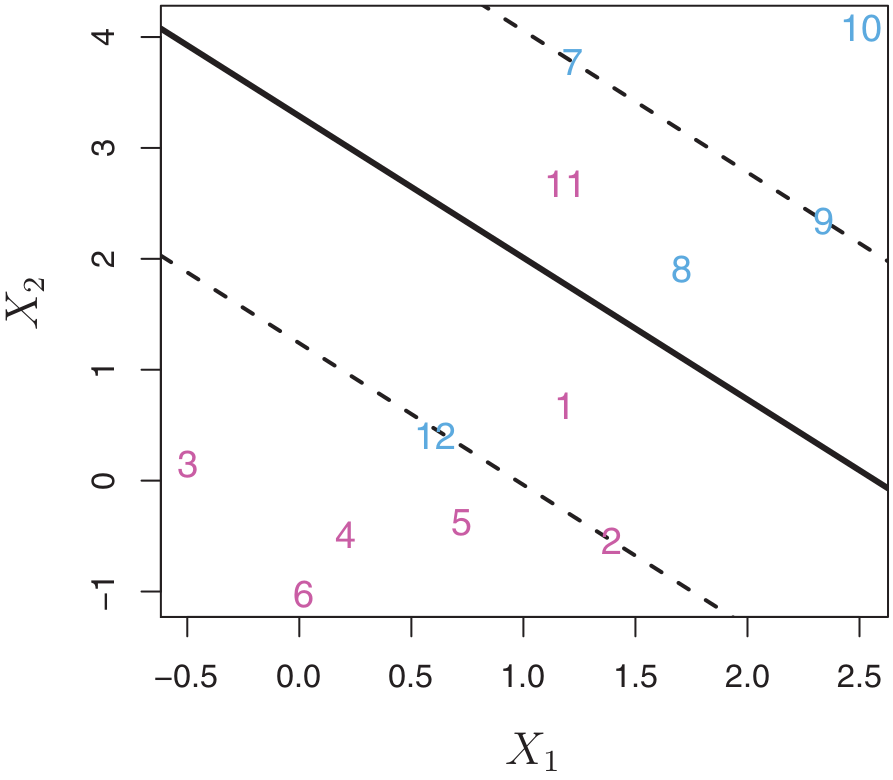] -->

.center[
.captionbox[

]]

---
count: false

- Add two additional points, $11$ and $12$

.center[
.captionbox[

.caption[.animated.fadeInRight[
Finding a perfect separating hyperplane is impossible here even if we wanted to]]
]]

<!-- 
<!-- width:13em">Finding a perfect separating hyperplane is impossible here even if we wanted to -->

???

These two observations are on the wrong side of the hyperplane and the wrong
side of the margin.

---
layout: true

.frametitle[
# Support Vector Classifier
## Details of the Support Vector Classifier
]

---

- Finding the hyperplane of the support vector classifier is the solution to the
  optimization problem

  <math style="font-size: 80%; margin-left: -2.5em;">$$\begin{align}
    & \underset{\beta_0, \beta_1, \ldots, \beta_p, \class{alert}{\epsilon_1, \ldots, \epsilon_n,} M}{\text{maximize}} & & M \tag{3a}\\
    & \text{subject to} & & \sum_{j=1}^p\beta_j^2=1 \tag{3b}\\
    & & & y_i(\beta_0 + \beta_1 x_{i1} + \beta_2 x_{i2} + \ldots + \beta_p x_{ip}) \geq M\class{alert}{(1-\epsilon_i)} \tag{3c} \\
    & & & \class{alert}{\epsilon_i \geq 0, \sum_{i=1}^n\epsilon_i \leq C} \tag{3d} \end{align}$$</math>

  where $C$ is a nonnegative tuning parameter

???

Notice the changes from the previous optimization problem!

---

- $M$ is still the width of the margin and we seek to make this quantity as
large as possible.
- $\epsilon_1, \ldots, \epsilon_n$ are slack variables that allow individual
observations to be on the wrong side of the margin or the hyperplane
- Once we have solved (3a)–(3d), we classify a test observation $x^*$ as before,
  by simply determining on which side of the hyperplane it lies

---
template: inverse

# Interpretation

The slack variable $\epsilon_i$ tells us where the $i$th observation is located
relative to the hyperplane and relative to the margin

---

layout: true

.frametitle[
# Support Vector Classifier
## Details of the Support Vector Classifier
]

---

- If $\epsilon_i = 0$ then the $i$th observation is on the correct side of the margin
--

- If $\epsilon_i > 0$ then the $i$th observation is on the wrong side of the margin
  - The $i$th observation has violated the margin
--

- If $\epsilon_i > 1$ then the $i$th observation is on the wrong side of the hyperplane

---

template: inverse

And what about $C$?

---

- $C$ bounds the sum of the $\epsilon_i$'s ➡ it determines the number and
  severity of the violations to the margin (and to the hyperplane) that we
  tolerate
--

- We can think of $C$ as a budget for the amount that the margin can be violated by the $n$ observations
--

  - If $C = 0$ then there is no budget for violations to the margin ➡ all
    $\epsilon_i$ values are equal to zero
  - For $C > 0$ no more than $C$ observations can be on the wrong side of the hyperplane
--

- As the budget C increases, we become more tolerant of
violations to the margin ➡ the margin will widen

---

template: inverse

# Interpretation

$C$ controls the bias-variance trade-off

It is treated as a tuning parameter that is generally **chosen via
cross-validation**

---
layout: false
.frametitle[
# Support Vector Classifier
## Interesting properties of $(\text{3a})$-$(\text{3d})$
]

- Only observations that either lie on the margin or that violate the margin
  will affect the hyperplane
--

- Observations that lie directly on the margin, or on the wrong side of the
  margin for their class, are known as support vectors.
--

Note:

When the tuning parameter $C$ is large the margin is wide and many observations violate the margin ➡ there are many support vectors

---
layout: true

.frametitle[
# Support Vector Classifier
## Effect of varying C
]

- As we decrease the value of $C$ the margin narrows and we have fewer support vectors

---

.center[
.captionbox[
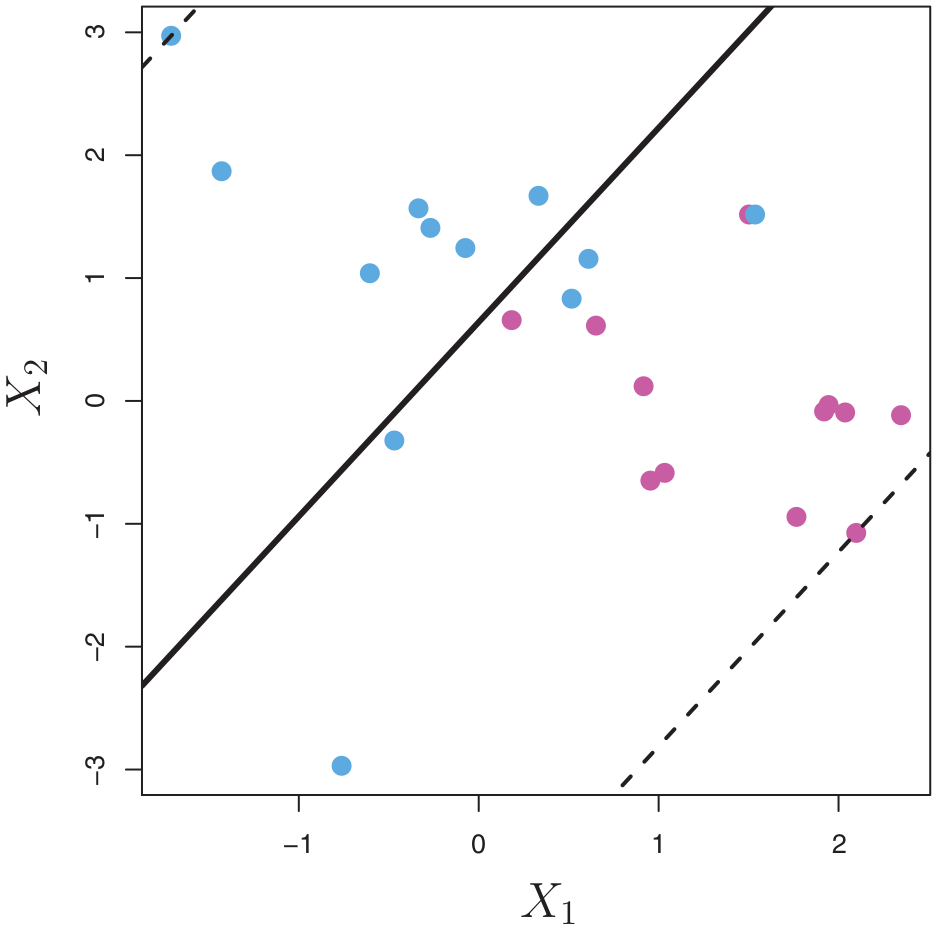
.caption[.animated.fadeInRight[
Many observations violate the margin, and so there are many support
vectors]]
]]

<!-- .center[] -->

<!-- 
<!-- width:13em">Many observations violate the margin, and so there are many support -->
<!-- vectors -->

---

.center[
.captionbox[
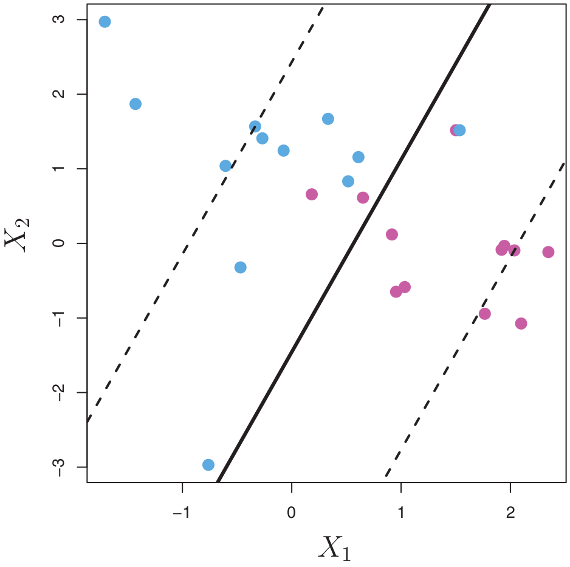
.caption[.animated.fadeInRight[
As $C$ decreases the margin decreases and we have fewer support vectors]]
]]

<!-- .center[] -->

<!-- As $C$ decreases the margin decreases and we have fewer support vectors -->

---

.center[
.captionbox[
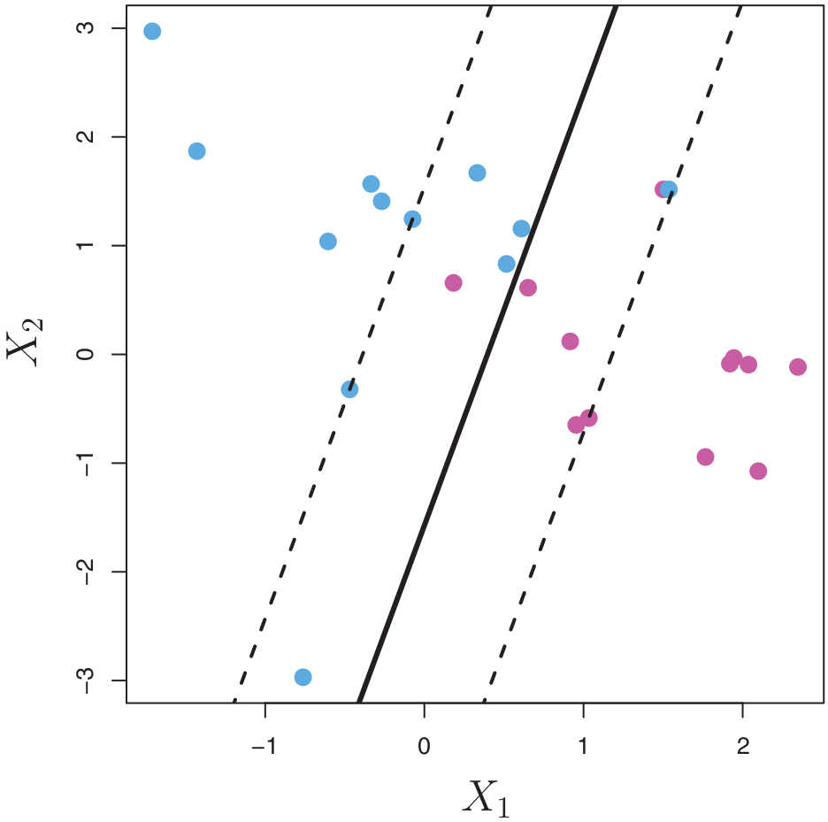
.caption[.animated.fadeInRight[
This means we reduce the bias, but since individual observations have a larger impact we are increasing the variance]]
]]

<!-- .center[] -->

<!-- This means we reduce the bias, but since individual observations have a larger impact we are increasing the variance -->

---

.center[
.captionbox[
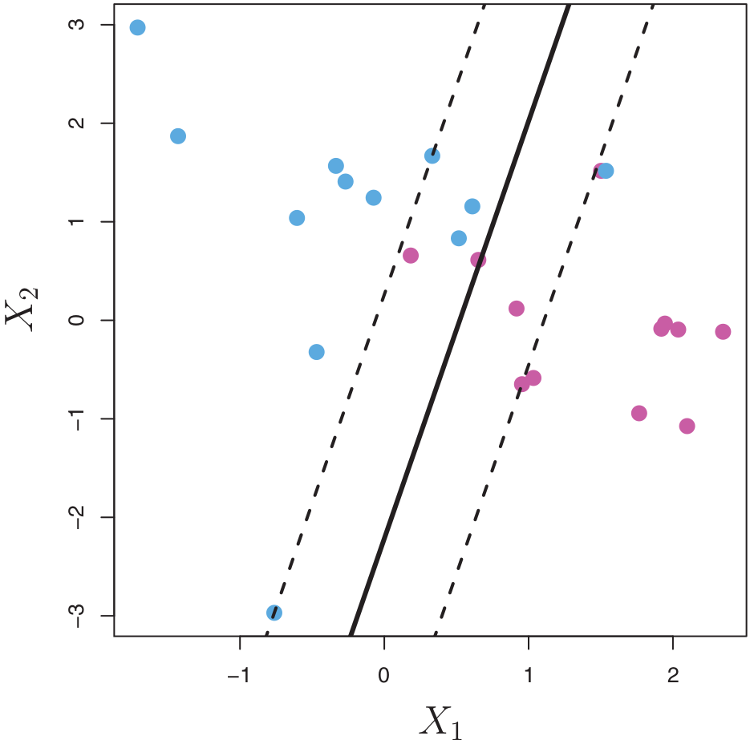
.caption[.animated.fadeInRight[
If we keep decreasing $C$ we walk towards the maximal margin classifier, but for this dataset there is no solution with $C=0$]]
]]

<!-- .center[] -->

<!-- If we keep decreasing $C$ we walk towards the maximal margin classifier, but for this dataset there is no solution with $C=0$ -->

---
template: inverse

# Insight

The fact that the support vector classifier's decision rule is based only on a
potentially small subset of the training observations (the support vectors)
means that it is quite robust to the behavior of observations that are far away
from the hyperplane

---
layout: true

.frametitle[
# Non-linear Decision Boundaries
]

---

- In practice we are sometimes faced with non-linear class boundaries
- A linear decision boundary is useless in this case

.center[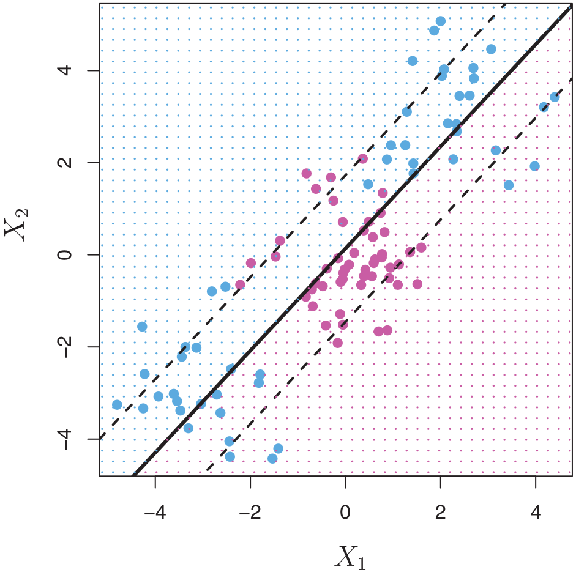]

---

- One alternative to address this non-linearity is to enlarge the feature space
  ➡ using functions of the predictors such as quadratic and cubic terms
--

- Rather than fitting a support vector classifier using $p$ features
<math>$$X_1, X_2, \ldots, X_p$$</math>
 we could instead fit a support vector classifier using $2p$ features
<math>$$X_1, X_1^2, X_2, X_2^2, \ldots, X_p, X_p^2$$</math>
--

- Other functions of the predictors could be considered rather than polynomials

Note:

There are many possible ways to enlarge the feature space Is there a better way?

---

template: inverse

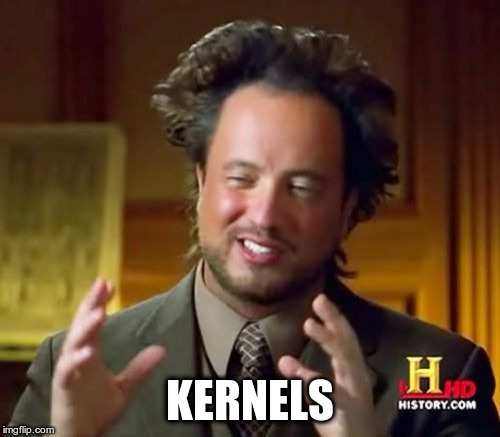

???

- Kernels are a simple and efficient way to **implicitly** enlarge the feature space

---
layout: true

.frametitle[
# Support Vector Machines]

---

- SVM is an extension of the support vector classifier that results from
  implicitly enlarging the feature space using a *kernel trick*
--

Note:

But first we need to rewrite the optimization problem in a more general way

---

- The **solution** of the vector classifier problem $(\text{3a})–(\text{3d})$ involves
  only inner products of the observations
- The inner product of two observations $x\_i$, $x\_i'$ is given by
  $$\langle x\_i, x\_i' \rangle = \sum\_{j=1}^p x\_{ij}x\_{ij}'$$
--

- The linear support vector classifier can be represented as
  $$f(x) = \beta\_0 + \sum\_{i=1}^{n}\alpha\_i \langle x\_i, x\_i' \rangle \tag{4}$$
  where there are $n$ parameters $\alpha\_i$, $i=1,\ldots, n$

---

- In order to evaluate the function $f(x)$ in $(4)$ we need to
compute the inner product between the new point $x$ and each of the training
points $x_i$
--

- But $\alpha_i$ is **nonzero only for the support vectors** in the solution
--

- We can then change the previous Equation to

  <math>$$f(x) = \beta_0 + \sum_{i \in \stS}\alpha_i \langle x_i, x_i' \rangle \tag{5}$$</math>

  which typically involves far fewer terms than $(4)$.
--

Note:

To summarize, in representing the linear classifier $f(x)$, and in computing its coefficients, all we need are inner products

---

- Now let's replace the inner product with a *generalization* in the form
  $$K(x\_i,x\_i')$$

  where $K$ is some function that we will refer as the *kernel*
--

Note:

A kernel is a function that quantifies the similarity of two observations

--

- **Example**: Linear Kernel (we get the support vector classifier)

<math>$$K(x_i, x_i') = \langle x_{i}, x_i'\rangle = \sum_{j=1}^p x_{ij} x_{i'j} \tag{6}$$</math>

---

layout: true

.frametitle[
# Support Vector Machines
## Other types of kernel]

---

### Polynomial kernel of degree $d$

$$K(x\_i,x\_i') = \left( 1 + \sum\_{j=1}^p x\_{ij} x\_{i'j} \right)^d$$
--

- Using such a kernel with $d > 1$, instead of the standard linear kernel leads
to a much more flexible decision boundary

Note that in this case the (non-linear)
function has the form

<math>$$f(x) = \beta_0 \sum_{i \in \stS}\alpha_i K(x, x_i)$$</math>

???

- It essentially amounts to fitting a support vector classifier in a
higher-dimensional space involving polynomials of degree d, rather than in the
original feature space.

---

- An SVM with a polynomial kernel of degree 3 applied to the non-linear data from before

.center[
.captionbox[
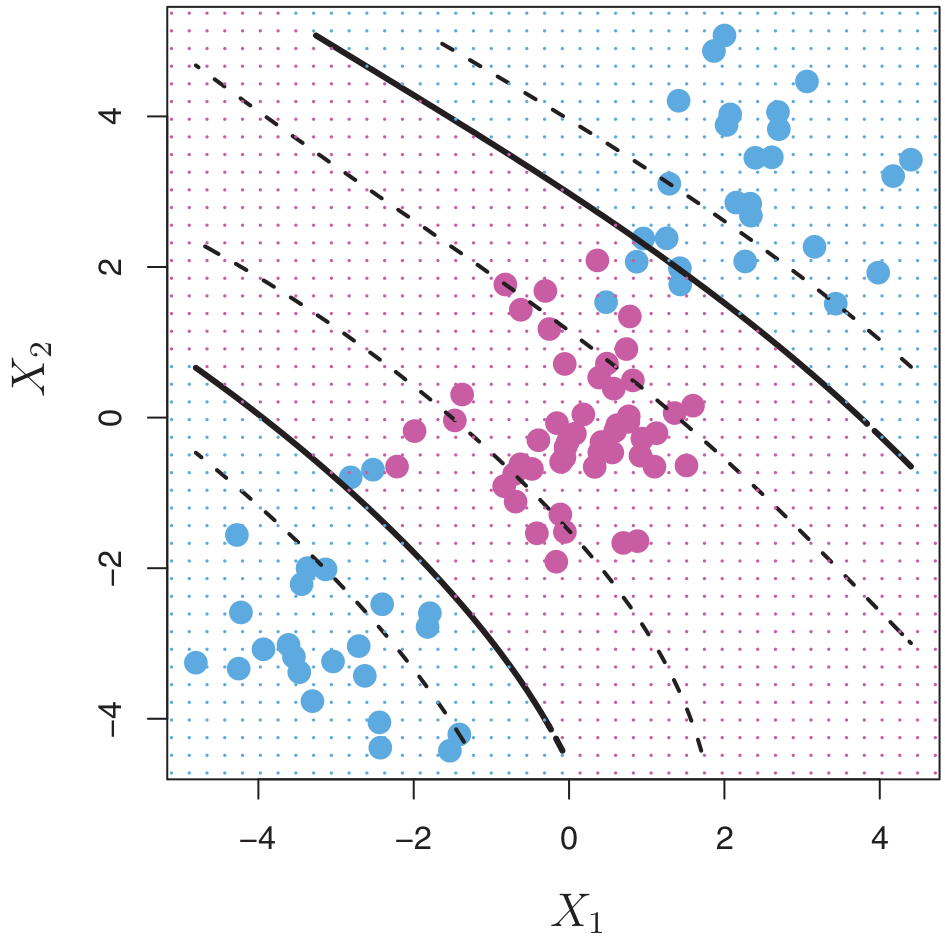
.caption[.animated.fadeInRight[
The fit is a substantial improvement over the linear support vector classifier]]
]]

<!-- .center[] -->

<!-- The fit is a substantial improvement over the linear support vector classifier -->

---

## Radial Kernel

$$K(x\_i, x\_i') = \exp \left( -\gamma \sum\_{j=1}^p (x\_{ij}-x'\_{ij})^2 \right)= \exp\left( -\gamma \Vert x\_i - x\_i' \Vert^2 \right)$$

--

&nbsp;

Note:

If a test observation $x^*$ is far from a training observation $x_i$ in terms of Euclidian distance, then $K(x_i, x_i')$ is very tiny

- $x_i$ essentially takes no role in predicting the label for $x^*$

---

- An SVM with a radial kernel applied to the non-linear data from before

.center[
.captionbox[
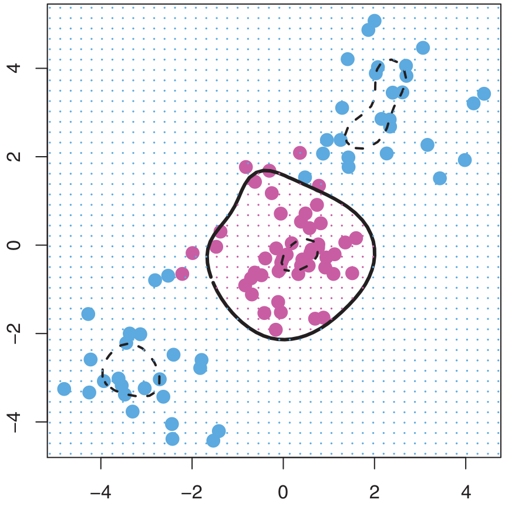
.caption[.animated.fadeInRight[
The radial kernel also performs much better than the linear kernel]]
]]

<!-- .center[] -->

<!-- The radial kernel also performs much better than the linear kernel -->

---

template: inverse

When the support vector classifier is combined with a non-linear kernel the
resulting classifier is known as a **support vector machine**

---
layout: false
.frametitle[
# Support Vector Machines
## Why use kernels]

- What is the advantage of using a kernel rather then enlarging the feature
  space using functions of the original features?
--

  - Computational: We only need to compute $K(x\_i,x\_i')$ for $\binom{n}{2}$
    distinct pairs
  - Which can be done **in the original feature space**
--

Note:

In many applications of SVMs, the enlarged feature space is so large that computations are intractable
<ul>
<li>The radial kernel has an implicit infinite-dimensional feature space!</li>
</ul>

---
template: inverse

# The kernel trick is awesome!

But SVM is still limited two separating between two classes, right?

---
.frametitle[
# SVMs with $K>2$ classes
]

- The concept of separating hyperplanes does not lend itself naturally to more
  than two classes

???
- Some proposed extensions to the $K$-class case are:

--

### one-versus-one

- Construct $\binom{K}{2}$ SVMs, each comparing a pair of classes
- The final classification is performed by assigning the test observation to the
  class to which it was most frequently assigned in these $\binom{K}{2}$
  pairwise classifications
--

### one-versus-all

- Fit $K$ SVMs, each time comparing one of the $K$ classes to the remaining
  $K-1$ classes
- Assign the observation to the class for which $\beta\_{0k}+\beta\_{1k}x\_1^\*+\beta\_{2k}x\_2^\*+\ldots+\beta\_{pk}x\_p^\*$ is largest ➡ hightest confidence

---

template: inverse

## Meh, but SVM only works in classification problems

---

.frametitle[
# Regression with SVMs
]

.extra-top-bottom-margin[
### Not on this presentation
]

More Info:

See
 <a href="https://alex.smola.org/papers/2003/SmoSch03b.pdf">https://alex.smola.org/papers/2003/SmoSch03b.pdf</a>
 <a href="http://kernelsvm.tripod.com/">http://kernelsvm.tripod.com/</a>
 <a href="https://en.wikipedia.org/wiki/Support_vector_machine?oldformat=true">https://en.wikipedia.org/wiki/Support_vector_machine?oldformat=true</a>
 <a href="https://sadanand-singh.github.io/posts/svmmodels/">https://sadanand-singh.github.io/posts/svmmodels/</a>

---
background-image: url(figs/the_end.png)
background-size: cover
